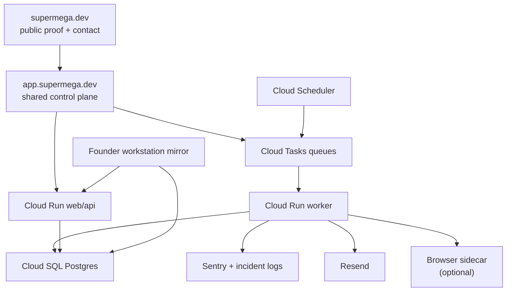

# Next-Gen Company Stack

This is the reference stack for SuperMega as an AI-native software company.

## What other people are doing

### Agent runtime
- OpenAI is pushing agent systems around tools, handoffs, guardrails, and evaluation, not around one giant omnipotent chatbot.
- Cloud-native teams are separating web requests from durable background work.
- Workflow products like Temporal and LangGraph are treating long-running work as replayable state machines instead of fragile request chains.
- Browser automation tools like Browser Use and OpenClaw are being used as sidecars where there is no API, not as the primary system of record.

### Commerce and operations software
- Shopify is pushing custom storefronts and composable commerce on top of a strong commerce core.
- Medusa and Vendure are strong choices when the business needs custom operational control around orders and fulfillment.
- Saleor is pushing app and API extensibility around commerce workflows.
- Odoo remains a broad reference point for inventory, purchase, manufacturing, and approvals.
- Square and Toast show that QR ordering works when it is tightly tied to the service queue, not when it is treated as a novelty.

## What SuperMega should do

SuperMega should not try to replace every SaaS product directly.

It should build:
- small operator systems
- reusable starter packs
- one shared control plane
- durable worker loops
- selective integrations with commerce and ERP components when needed

That is the difference between "AI company" marketing and a real AI-native software company.

## Recommended architecture

## Product stack by product type

### 1. Queue-first operator systems
Use the current SuperMega stack:
- React frontend
- FastAPI or Python backend
- Cloud Run
- Cloud Tasks
- Cloud SQL

Use for:
- Sales Desk
- Receiving Control
- Founder Brief
- Approval Flow
- Document Intake

### 2. Commerce and order systems
Do not rebuild the commerce kernel by default.

Use:
- Shopify when the client already lives in Shopify or needs the fastest merchant-friendly launch
- Medusa or Vendure when SuperMega needs more operational control over order routing, custom flows, or back-office logic

Use for:
- Commerce Back Office
- Order Inbox Desk
- QR Ordering Desk

### 3. Client-facing systems
Use the current app stack unless the client already has a strong commerce platform.

Use for:
- Client Portal Starter
- Learning Hub
- approval portals
- supplier portals

## Product strategy for Myanmar

Sell first into:
- owner-led distributors
- importers
- warehouses
- light factories
- service operators

Because their real pain is:
- scattered work across Facebook, Viber, WhatsApp, Gmail, Excel, and paper
- poor follow-up discipline
- unclear ownership
- manual approvals
- inbound order and receiving confusion

So the first useful products are:
- Distributor Sales Desk
- Receiving Control
- Founder Brief
- Order Inbox Desk
- QR Ordering Desk

## Team and tooling model

### Founder Desk
- priorities
- pricing
- approvals
- daily brief review

### Revenue Pod
- demand generation
- deals
- pipeline hygiene
- outbound follow-up

### Delivery Pod
- client provisioning
- queue setup
- rollout tracking
- issue handling

### Agent Ops
- scheduler health
- queue health
- failed jobs
- release safety

## What to add next

### Infrastructure
- dedicated worker service
- later browser-worker service
- Sentry on backend and frontend
- Resend delivery once DNS is complete

### Product
- Deals / Revenue surface in the app
- contact submission to deal creation
- product screenshots and proof on the public site
- first guided onboarding into a chosen starter pack

### Agent loops
- Deals Clerk
- Release Guard
- Delivery Watch
- Browser Clerk only when needed

## What to avoid

- selling "AI-native ERP" as the first message
- making browser automation the primary runtime
- building giant custom systems before there is a repeatable starter pack
- copying giant SaaS products feature for feature

## Reference sources

- OpenAI practical guide to building agents:
  - https://openai.com/business/guides-and-resources/a-practical-guide-to-building-agents/
- OpenAI Agents SDK:
  - https://platform.openai.com/docs/guides/agents-sdk
- Cloud Run autoscaling and min instances:
  - https://cloud.google.com/run/docs/about-instance-autoscaling
  - https://cloud.google.com/run/docs/configuring/min-instances
- Cloud Tasks:
  - https://cloud.google.com/tasks/docs
  - https://cloud.google.com/tasks/docs/creating-http-target-tasks
- Temporal:
  - https://docs.temporal.io/temporal
- LangGraph:
  - https://docs.langchain.com/oss/python/langgraph/overview
- Browser Use:
  - https://docs.browser-use.com/
  - https://docs.browser-use.com/cloud/tutorials/integrations/openclaw
- Shopify headless:
  - https://shopify.dev/docs/storefronts/headless
- Medusa:
  - https://docs.medusajs.com/
- Vendure:
  - https://docs.vendure.io/
- Saleor:
  - https://docs.saleor.io/
- Odoo documentation:
  - https://www.odoo.com/documentation/18.0/
- Square online ordering:
  - https://squareup.com/us/en/online-ordering
- Toast order and pay:
  - https://pos.toasttab.com/products/order-and-pay
