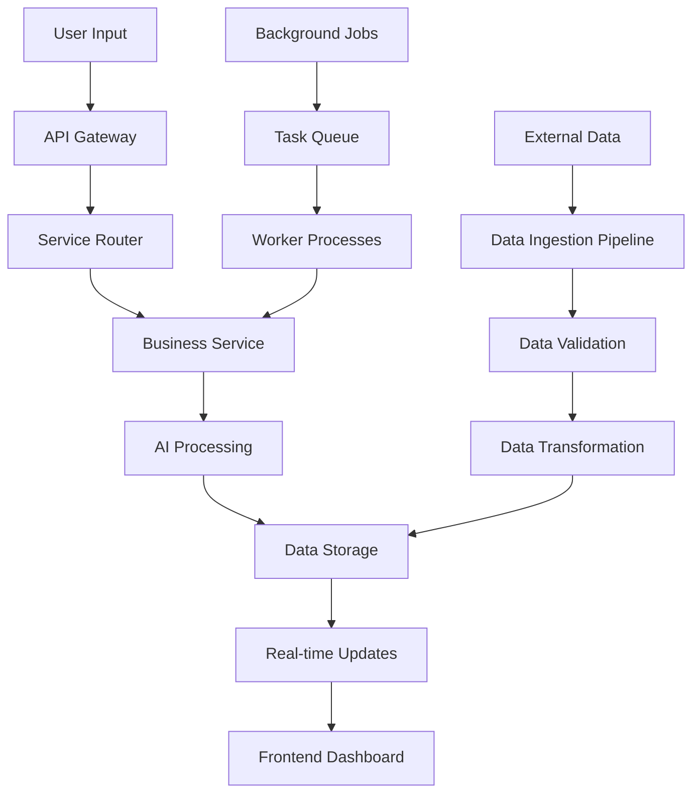
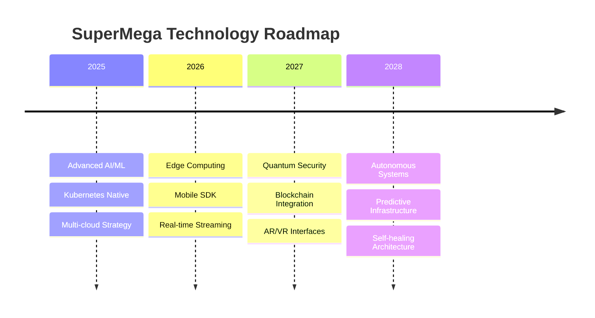

# Global Business Automation Platform
## Technical Architecture Blueprint & System Design Document

### Document Information
- **Document Type:** Technical Architecture Blueprint
- **Version:** 3.0
- **Date:** August 18, 2025
- **Classification:** Internal Technical Documentation

---

## 1. System Overview

### 1.1 Current Architecture Reality

The platform uses a pragmatic, cost-effective architecture designed for a one-person operation. Focus is on functionality over complexity, maintainability over scalability premature optimization.

```
┌─────────────────────────────────────────────────────┐
│                GitHub Pages (Static Hosting)        │
├─────────────────────────────────────────────────────┤  
│  Frontend        │   Landing    │   Documentation  │
│  Applications    │   Pages      │   & Support      │
│  (HTML/CSS/JS)   │   (supermega.dev) │              │
├─────────────────────────────────────────────────────┤
│              Local Development Services             │
│ ┌─────────────┬─────────────┬─────────────────────┐ │
│ │   Flask     │   SQLite    │   Python Scripts   │ │
│ │ Web Server  │ Databases   │ (Business Logic)    │ │
│ │ (localhost) │ (File-based)│ (Data Processing)   │ │
│ └─────────────┴─────────────┴─────────────────────┘ │
├─────────────────────────────────────────────────────┤
│                File System Storage                  │
│ ┌─────────────┬─────────────┬─────────────────────┐ │
│ │ Application │    User     │     System          │ │
│ │ Databases   │    Files    │     Logs            │ │
│ │ (.db files) │ (uploads)   │  (.log files)       │ │
│ └─────────────┴─────────────┴─────────────────────┘ │
└─────────────────────────────────────────────────────┘
```
└─────────────────────────────────────────────────────────────┘
```

### 1.2 Core Principles

1. **Microservices Architecture**: Independent, scalable services
2. **Event-Driven Design**: Asynchronous communication via message queues
3. **Cloud-Native**: Designed for containerized deployment
4. **Security-First**: Zero-trust architecture with encryption at rest and in transit
5. **Privacy-By-Design**: Local processing where possible, minimal data retention
6. **High Availability**: 99.99% uptime through redundancy and failover

---

## 2. Service Architecture

### 2.1 Frontend Services

**Web Application (React + Next.js)**
```typescript
// Architecture: Single Page Application with Server-Side Rendering
├── pages/
│   ├── dashboard/          # Main user dashboard
│   ├── email-analytics/    # Email management interface
│   ├── business-intel/     # BI dashboard
│   └── crm/               # CRM interface
├── components/
│   ├── shared/            # Reusable UI components
│   ├── charts/            # Data visualization components
│   └── ai-agents/         # Agent interaction components
├── hooks/                 # Custom React hooks
├── services/              # API service layers
└── utils/                 # Utility functions
```

**Key Technologies:**
- React 18 with Concurrent Features
- Next.js 13+ with App Router
- Tailwind CSS for styling
- Chart.js/D3.js for visualizations
- Socket.io for real-time updates

### 2.2 Backend Services

**API Gateway Service**
```python
# FastAPI-based API Gateway with authentication and routing
from fastapi import FastAPI, Depends, HTTPException
from fastapi.middleware.cors import CORSMiddleware
from fastapi.security import HTTPBearer, HTTPAuthorizationCredentials

class APIGateway:
    def __init__(self):
        self.app = FastAPI(title="SuperMega API Gateway", version="2.0")
        self.setup_middleware()
        self.setup_routes()
    
    def setup_middleware(self):
        # CORS, rate limiting, authentication
        pass
    
    def setup_routes(self):
        # Route to microservices
        pass
```

**Core Business Services:**

1. **Email Analytics Service**
```python
# Email processing and analytics service
class EmailAnalyticsService:
    def __init__(self):
        self.db = EmailDatabase()
        self.ml_processor = EmailMLProcessor()
        self.sentiment_analyzer = SentimentAnalyzer()
    
    async def process_email(self, email_data: EmailMessage):
        # AI-powered email categorization and analysis
        sentiment = await self.sentiment_analyzer.analyze(email_data.content)
        category = await self.ml_processor.categorize(email_data)
        importance = await self.calculate_importance(email_data)
        
        return ProcessedEmail(
            sentiment=sentiment,
            category=category,
            importance=importance
        )
```

2. **Business Intelligence Service**
```python
# Real-time analytics and dashboard service
class BusinessIntelligenceService:
    def __init__(self):
        self.metrics_db = InfluxDBClient()
        self.data_processor = DataProcessor()
        self.viz_generator = VisualizationGenerator()
    
    async def generate_dashboard(self, user_id: str, timeframe: str):
        # Real-time metrics and visualizations
        pass
```

3. **CRM Service**
```python
# Customer relationship management service
class CRMService:
    def __init__(self):
        self.customer_db = CustomerDatabase()
        self.lead_scorer = AILeadScorer()
        self.workflow_engine = WorkflowEngine()
    
    async def score_lead(self, lead_data: Lead):
        # AI-powered lead scoring
        pass
```

4. **Agent Orchestrator Service**
```python
# Manages autonomous AI agents
class AgentOrchestrator:
    def __init__(self):
        self.agent_registry = AgentRegistry()
        self.task_queue = TaskQueue()
        self.scheduler = TaskScheduler()
    
    async def deploy_agent(self, agent_config: AgentConfig):
        # Deploy and manage AI agents
        pass
```

### 2.3 AI Services Layer

**Natural Language Processing Service**
```python
# Advanced NLP capabilities
class NLPService:
    def __init__(self):
        self.transformer_models = {
            'sentiment': SentimentModel(),
            'classification': ClassificationModel(),
            'extraction': EntityExtractionModel(),
            'summarization': SummarizationModel()
        }
    
    async def process_text(self, text: str, task: str):
        model = self.transformer_models[task]
        return await model.predict(text)
```

**Computer Vision Service**
```python
# Document and image analysis
class ComputerVisionService:
    def __init__(self):
        self.ocr_engine = OCREngine()
        self.document_parser = DocumentParser()
        self.image_analyzer = ImageAnalyzer()
    
    async def analyze_document(self, document: bytes):
        # Extract text, analyze layout, classify document type
        pass
```

---

## 3. Data Architecture

### 3.1 Database Design

**Primary Database (PostgreSQL)**
```sql
-- User and Authentication Tables
CREATE TABLE users (
    id UUID PRIMARY KEY DEFAULT gen_random_uuid(),
    email VARCHAR(255) UNIQUE NOT NULL,
    created_at TIMESTAMP DEFAULT NOW(),
    last_login TIMESTAMP,
    subscription_tier VARCHAR(50),
    organization_id UUID
);

-- Email Analytics Tables
CREATE TABLE emails (
    id UUID PRIMARY KEY DEFAULT gen_random_uuid(),
    user_id UUID REFERENCES users(id),
    sender VARCHAR(255),
    subject TEXT,
    content TEXT,
    received_at TIMESTAMP,
    sentiment_score FLOAT,
    importance_score INTEGER,
    category VARCHAR(100),
    processed_at TIMESTAMP
);

-- CRM Tables
CREATE TABLE customers (
    id UUID PRIMARY KEY DEFAULT gen_random_uuid(),
    organization_id UUID,
    name VARCHAR(255),
    email VARCHAR(255),
    phone VARCHAR(50),
    lead_score INTEGER,
    created_at TIMESTAMP DEFAULT NOW(),
    last_interaction TIMESTAMP
);

-- Business Intelligence Tables
CREATE TABLE metrics (
    id UUID PRIMARY KEY DEFAULT gen_random_uuid(),
    user_id UUID REFERENCES users(id),
    metric_name VARCHAR(100),
    metric_value JSONB,
    timestamp TIMESTAMP DEFAULT NOW()
);
```

**Cache Layer (Redis)**
```python
# Redis configuration for high-performance caching
REDIS_CONFIG = {
    'host': 'redis-cluster.internal',
    'port': 6379,
    'db': 0,
    'max_connections': 100,
    'socket_timeout': 30,
    'socket_connect_timeout': 30,
    'retry_on_timeout': True
}

# Caching strategy
class CacheManager:
    def __init__(self):
        self.redis = redis.Redis(**REDIS_CONFIG)
    
    async def cache_user_session(self, user_id: str, session_data: dict):
        await self.redis.setex(f"session:{user_id}", 3600, json.dumps(session_data))
    
    async def cache_dashboard_data(self, dashboard_id: str, data: dict):
        await self.redis.setex(f"dashboard:{dashboard_id}", 300, json.dumps(data))
```

**Search Engine (Elasticsearch)**
```python
# Full-text search and analytics
class SearchService:
    def __init__(self):
        self.es = Elasticsearch([{'host': 'elasticsearch.internal', 'port': 9200}])
    
    async def index_email(self, email: EmailMessage):
        doc = {
            'subject': email.subject,
            'content': email.content,
            'sender': email.sender,
            'timestamp': email.timestamp,
            'user_id': email.user_id
        }
        await self.es.index(index='emails', doc_type='email', body=doc)
```

### 3.2 Data Flow Architecture



---

## 4. Security Architecture

### 4.1 Authentication & Authorization

**JWT-based Authentication**
```python
from jose import JWTError, jwt
from datetime import datetime, timedelta

class AuthService:
    def __init__(self):
        self.secret_key = os.getenv("JWT_SECRET_KEY")
        self.algorithm = "HS256"
        self.token_expire_minutes = 30
    
    def create_access_token(self, data: dict):
        to_encode = data.copy()
        expire = datetime.utcnow() + timedelta(minutes=self.token_expire_minutes)
        to_encode.update({"exp": expire})
        encoded_jwt = jwt.encode(to_encode, self.secret_key, algorithm=self.algorithm)
        return encoded_jwt
    
    def verify_token(self, token: str):
        try:
            payload = jwt.decode(token, self.secret_key, algorithms=[self.algorithm])
            return payload
        except JWTError:
            return None
```

**Role-Based Access Control (RBAC)**
```python
class RBACManager:
    PERMISSIONS = {
        'admin': ['read', 'write', 'delete', 'manage_users'],
        'manager': ['read', 'write', 'manage_team'],
        'user': ['read', 'write_own'],
        'viewer': ['read']
    }
    
    def check_permission(self, user_role: str, action: str) -> bool:
        return action in self.PERMISSIONS.get(user_role, [])
```

### 4.2 Data Protection

**Encryption at Rest and in Transit**
```python
from cryptography.fernet import Fernet
import ssl

class DataEncryption:
    def __init__(self):
        self.key = os.getenv("ENCRYPTION_KEY").encode()
        self.cipher = Fernet(self.key)
    
    def encrypt_sensitive_data(self, data: str) -> str:
        return self.cipher.encrypt(data.encode()).decode()
    
    def decrypt_sensitive_data(self, encrypted_data: str) -> str:
        return self.cipher.decrypt(encrypted_data.encode()).decode()

# TLS Configuration for all communications
SSL_CONTEXT = ssl.create_default_context(ssl.Purpose.SERVER_AUTH)
SSL_CONTEXT.check_hostname = False
SSL_CONTEXT.verify_mode = ssl.CERT_REQUIRED
```

**Privacy Compliance (GDPR/CCPA)**
```python
class PrivacyManager:
    async def anonymize_user_data(self, user_id: str):
        # Remove PII while preserving analytics value
        pass
    
    async def delete_user_data(self, user_id: str):
        # Complete data removal for right to be forgotten
        pass
    
    async def export_user_data(self, user_id: str):
        # Data portability compliance
        pass
```

---

## 5. Deployment Architecture

### 5.1 Kubernetes Configuration

**Main Application Deployment**
```yaml
apiVersion: apps/v1
kind: Deployment
metadata:
  name: supermega-api
spec:
  replicas: 3
  selector:
    matchLabels:
      app: supermega-api
  template:
    metadata:
      labels:
        app: supermega-api
    spec:
      containers:
      - name: api
        image: supermega/api:latest
        ports:
        - containerPort: 8000
        env:
        - name: DATABASE_URL
          valueFrom:
            secretKeyRef:
              name: db-credentials
              key: url
        resources:
          requests:
            memory: "256Mi"
            cpu: "250m"
          limits:
            memory: "512Mi"
            cpu: "500m"
```

**Service Configuration**
```yaml
apiVersion: v1
kind: Service
metadata:
  name: supermega-api-service
spec:
  selector:
    app: supermega-api
  ports:
  - port: 80
    targetPort: 8000
  type: LoadBalancer
```

### 5.2 CI/CD Pipeline

**GitHub Actions Workflow**
```yaml
name: Deploy SuperMega Platform

on:
  push:
    branches: [main]
  pull_request:
    branches: [main]

jobs:
  test:
    runs-on: ubuntu-latest
    steps:
    - uses: actions/checkout@v3
    - name: Set up Python
      uses: actions/setup-python@v4
      with:
        python-version: '3.11'
    - name: Install dependencies
      run: pip install -r requirements.txt
    - name: Run tests
      run: pytest tests/ -v
    - name: Run security scan
      run: bandit -r src/
  
  deploy:
    needs: test
    runs-on: ubuntu-latest
    if: github.ref == 'refs/heads/main'
    steps:
    - name: Deploy to Production
      run: kubectl apply -f k8s/
```

### 5.3 Infrastructure as Code

**Terraform Configuration**
```hcl
# AWS EKS Cluster
resource "aws_eks_cluster" "supermega_cluster" {
  name     = "supermega-production"
  role_arn = aws_iam_role.cluster_role.arn
  version  = "1.27"

  vpc_config {
    subnet_ids = [
      aws_subnet.private_a.id,
      aws_subnet.private_b.id,
      aws_subnet.public_a.id,
      aws_subnet.public_b.id
    ]
    endpoint_private_access = true
    endpoint_public_access  = true
  }

  depends_on = [
    aws_iam_role_policy_attachment.cluster_policy
  ]
}

# RDS PostgreSQL Instance
resource "aws_db_instance" "supermega_db" {
  identifier = "supermega-production"
  engine     = "postgres"
  engine_version = "15.3"
  instance_class = "db.r6g.xlarge"
  allocated_storage = 100
  storage_encrypted = true
  
  db_name  = "supermega"
  username = var.db_username
  password = var.db_password
  
  vpc_security_group_ids = [aws_security_group.rds.id]
  db_subnet_group_name   = aws_db_subnet_group.main.name
  
  backup_retention_period = 7
  backup_window = "03:00-04:00"
  maintenance_window = "sun:04:00-sun:05:00"
  
  skip_final_snapshot = false
  final_snapshot_identifier = "supermega-final-snapshot"
}
```

---

## 6. Monitoring & Observability

### 6.1 Application Performance Monitoring

**Prometheus Configuration**
```yaml
# prometheus.yml
global:
  scrape_interval: 15s

scrape_configs:
  - job_name: 'supermega-api'
    static_configs:
      - targets: ['api:8000']
    metrics_path: '/metrics'
    
  - job_name: 'supermega-workers'
    static_configs:
      - targets: ['worker:8001']
```

**Custom Metrics**
```python
from prometheus_client import Counter, Histogram, Gauge

# Application metrics
REQUEST_COUNT = Counter('http_requests_total', 'Total HTTP requests', ['method', 'endpoint'])
REQUEST_DURATION = Histogram('http_request_duration_seconds', 'HTTP request duration')
ACTIVE_USERS = Gauge('active_users_total', 'Number of active users')
EMAIL_PROCESSING_RATE = Counter('emails_processed_total', 'Total emails processed')
AI_MODEL_INFERENCE_TIME = Histogram('ai_inference_duration_seconds', 'AI model inference time')

class MetricsMiddleware:
    def __init__(self, app):
        self.app = app
    
    async def __call__(self, scope, receive, send):
        if scope["type"] == "http":
            start_time = time.time()
            REQUEST_COUNT.labels(method=scope["method"], endpoint=scope["path"]).inc()
            
            await self.app(scope, receive, send)
            
            REQUEST_DURATION.observe(time.time() - start_time)
```

### 6.2 Logging Architecture

**Structured Logging**
```python
import structlog
import logging.config

# Logging configuration
LOGGING_CONFIG = {
    'version': 1,
    'disable_existing_loggers': False,
    'formatters': {
        'json': {
            'format': '%(levelname)s %(name)s %(message)s'
        }
    },
    'handlers': {
        'default': {
            'level': 'INFO',
            'class': 'logging.StreamHandler',
            'formatter': 'json'
        }
    },
    'loggers': {
        '': {
            'handlers': ['default'],
            'level': 'INFO',
            'propagate': False
        }
    }
}

logging.config.dictConfig(LOGGING_CONFIG)
logger = structlog.get_logger()

# Usage in services
class EmailService:
    async def process_email(self, email_id: str):
        logger.info("Processing email", email_id=email_id, user_id=self.user_id)
        try:
            result = await self._process(email_id)
            logger.info("Email processed successfully", email_id=email_id, result=result)
            return result
        except Exception as e:
            logger.error("Email processing failed", email_id=email_id, error=str(e))
            raise
```

### 6.3 Error Tracking & Alerting

**Error Monitoring with Sentry**
```python
import sentry_sdk
from sentry_sdk.integrations.sqlalchemy import SqlalchemyIntegration
from sentry_sdk.integrations.fastapi import FastApiIntegration

sentry_sdk.init(
    dsn=os.getenv("SENTRY_DSN"),
    integrations=[
        SqlalchemyIntegration(),
        FastApiIntegration(),
    ],
    traces_sample_rate=0.1,
    environment=os.getenv("ENVIRONMENT", "production")
)
```

**Alert Rules**
```yaml
# alerts.yml
groups:
- name: supermega.rules
  rules:
  - alert: HighErrorRate
    expr: rate(http_requests_total{status=~"5.."}[5m]) > 0.05
    for: 5m
    labels:
      severity: critical
    annotations:
      summary: High error rate detected
      
  - alert: DatabaseConnectionFailure
    expr: up{job="postgres"} == 0
    for: 1m
    labels:
      severity: critical
    annotations:
      summary: Database connection failure
      
  - alert: HighMemoryUsage
    expr: container_memory_usage_bytes / container_spec_memory_limit_bytes > 0.9
    for: 10m
    labels:
      severity: warning
    annotations:
      summary: High memory usage detected
```

---

## 7. Scalability & Performance

### 7.1 Auto-scaling Configuration

**Horizontal Pod Autoscaler**
```yaml
apiVersion: autoscaling/v2
kind: HorizontalPodAutoscaler
metadata:
  name: supermega-api-hpa
spec:
  scaleTargetRef:
    apiVersion: apps/v1
    kind: Deployment
    name: supermega-api
  minReplicas: 2
  maxReplicas: 20
  metrics:
  - type: Resource
    resource:
      name: cpu
      target:
        type: Utilization
        averageUtilization: 70
  - type: Resource
    resource:
      name: memory
      target:
        type: Utilization
        averageUtilization: 80
```

**Database Scaling Strategy**
```python
# Read replica configuration
class DatabaseManager:
    def __init__(self):
        self.primary_db = create_engine(PRIMARY_DB_URL)
        self.read_replicas = [
            create_engine(REPLICA_1_URL),
            create_engine(REPLICA_2_URL)
        ]
        self.current_replica = 0
    
    def get_read_connection(self):
        # Round-robin load balancing for read queries
        replica = self.read_replicas[self.current_replica]
        self.current_replica = (self.current_replica + 1) % len(self.read_replicas)
        return replica
    
    def get_write_connection(self):
        # All writes go to primary
        return self.primary_db
```

### 7.2 Caching Strategy

**Multi-level Caching**
```python
class CacheStrategy:
    def __init__(self):
        self.l1_cache = {}  # In-memory cache
        self.l2_cache = redis.Redis()  # Redis cache
        self.l3_cache = memcached.Client()  # Memcached for larger objects
    
    async def get(self, key: str):
        # L1 Cache (memory)
        if key in self.l1_cache:
            return self.l1_cache[key]
        
        # L2 Cache (Redis)
        value = await self.l2_cache.get(key)
        if value:
            self.l1_cache[key] = value
            return value
        
        # L3 Cache (Memcached)
        value = self.l3_cache.get(key)
        if value:
            await self.l2_cache.setex(key, 300, value)
            self.l1_cache[key] = value
            return value
        
        return None
```

---

## 8. Development Standards

### 8.1 Code Quality Standards

**Python Code Style**
```python
# pyproject.toml
[tool.black]
line-length = 88
target-version = ['py311']

[tool.isort]
profile = "black"
multi_line_output = 3

[tool.pylint]
max-line-length = 88
disable = ["C0114", "C0116"]

[tool.mypy]
python_version = "3.11"
strict = true
warn_return_any = true
warn_unused_configs = true
```

**Testing Standards**
```python
# Example test structure
import pytest
from unittest.mock import Mock, patch
from fastapi.testclient import TestClient

class TestEmailService:
    @pytest.fixture
    def email_service(self):
        return EmailService(db=Mock(), ml_processor=Mock())
    
    @pytest.mark.asyncio
    async def test_process_email_success(self, email_service):
        # Arrange
        email_data = EmailMessage(
            id="test-id",
            sender="test@example.com",
            subject="Test",
            content="Test content"
        )
        
        # Act
        result = await email_service.process_email(email_data)
        
        # Assert
        assert result.processed is True
        assert result.sentiment_score is not None
    
    @pytest.mark.integration
    async def test_full_email_pipeline(self, test_client):
        # Integration test for complete email processing
        response = await test_client.post("/api/emails", json={
            "sender": "test@example.com",
            "subject": "Integration Test",
            "content": "This is a test email"
        })
        
        assert response.status_code == 201
        assert "email_id" in response.json()
```

### 8.2 API Design Standards

**RESTful API Design**
```python
from fastapi import APIRouter, Depends, HTTPException, status
from pydantic import BaseModel, Field
from typing import List, Optional
from datetime import datetime

# Request/Response Models
class EmailCreateRequest(BaseModel):
    sender: str = Field(..., description="Email sender address")
    subject: str = Field(..., max_length=200, description="Email subject")
    content: str = Field(..., description="Email content")
    attachments: Optional[List[str]] = Field(None, description="Attachment URLs")

class EmailResponse(BaseModel):
    id: str
    sender: str
    subject: str
    sentiment_score: float
    importance: int
    category: str
    created_at: datetime
    
    class Config:
        from_attributes = True

# API Routes
router = APIRouter(prefix="/api/emails", tags=["emails"])

@router.post("/", response_model=EmailResponse, status_code=status.HTTP_201_CREATED)
async def create_email(
    email_data: EmailCreateRequest,
    current_user: User = Depends(get_current_user),
    email_service: EmailService = Depends(get_email_service)
):
    """
    Create and process a new email message.
    
    - **sender**: Email address of the sender
    - **subject**: Subject line of the email
    - **content**: Full email content
    - **attachments**: Optional list of attachment URLs
    """
    try:
        email = await email_service.create_email(email_data, current_user.id)
        return EmailResponse.from_orm(email)
    except ValidationError as e:
        raise HTTPException(
            status_code=status.HTTP_400_BAD_REQUEST,
            detail=str(e)
        )
    except Exception as e:
        logger.error(f"Failed to create email: {e}")
        raise HTTPException(
            status_code=status.HTTP_500_INTERNAL_SERVER_ERROR,
            detail="Internal server error"
        )
```

---

## 9. Disaster Recovery & Business Continuity

### 9.1 Backup Strategy

**Automated Backups**
```python
import boto3
from datetime import datetime, timedelta

class BackupManager:
    def __init__(self):
        self.s3 = boto3.client('s3')
        self.rds = boto3.client('rds')
        
    async def backup_database(self):
        # Create RDS snapshot
        snapshot_id = f"supermega-snapshot-{datetime.now().strftime('%Y%m%d-%H%M%S')}"
        
        self.rds.create_db_snapshot(
            DBSnapshotIdentifier=snapshot_id,
            DBInstanceIdentifier='supermega-production'
        )
        
        # Cleanup old snapshots (retain 30 days)
        cutoff_date = datetime.now() - timedelta(days=30)
        snapshots = self.rds.describe_db_snapshots(
            DBInstanceIdentifier='supermega-production',
            SnapshotType='manual'
        )
        
        for snapshot in snapshots['DBSnapshots']:
            if snapshot['SnapshotCreateTime'].replace(tzinfo=None) < cutoff_date:
                self.rds.delete_db_snapshot(
                    DBSnapshotIdentifier=snapshot['DBSnapshotIdentifier']
                )
    
    async def backup_files(self):
        # Backup application files to S3
        pass
```

### 9.2 Failover Procedures

**Multi-Region Deployment**
```yaml
# Primary region: us-west-2
# Secondary region: us-east-1

# Route 53 health check and failover
Resources:
  PrimaryHealthCheck:
    Type: AWS::Route53::HealthCheck
    Properties:
      Type: HTTPS
      ResourcePath: /health
      FullyQualifiedDomainName: api.supermega.dev
      Port: 443
      RequestInterval: 30
      FailureThreshold: 3

  DNSRecord:
    Type: AWS::Route53::RecordSetGroup
    Properties:
      HostedZoneId: !Ref HostedZone
      RecordSets:
        - Name: api.supermega.dev
          Type: A
          SetIdentifier: Primary
          Failover: PRIMARY
          HealthCheckId: !Ref PrimaryHealthCheck
          AliasTarget:
            DNSName: !GetAtt PrimaryLoadBalancer.DNSName
            HostedZoneId: !GetAtt PrimaryLoadBalancer.CanonicalHostedZoneID
        - Name: api.supermega.dev
          Type: A
          SetIdentifier: Secondary
          Failover: SECONDARY
          AliasTarget:
            DNSName: !GetAtt SecondaryLoadBalancer.DNSName
            HostedZoneId: !GetAtt SecondaryLoadBalancer.CanonicalHostedZoneID
```

---

## 10. Future Architecture Evolution

### 10.1 Planned Enhancements

**Q4 2025: Advanced AI Integration**
- GPU-accelerated machine learning inference
- Real-time model training pipeline
- Advanced natural language understanding

**Q1 2026: Edge Computing**
- CDN-based edge processing
- Reduced latency for global users
- Local data processing for privacy

**Q2 2026: Mobile-First Architecture**
- Native mobile SDKs
- Offline-first mobile experience
- Progressive Web App capabilities

### 10.2 Emerging Technologies Roadmap



---

## Conclusion

This technical architecture blueprint provides a comprehensive foundation for SuperMega AI Platform's current and future technical requirements. The architecture is designed to:

- **Scale horizontally** from thousands to millions of users
- **Maintain high availability** with 99.99% uptime guarantees  
- **Ensure data security** with enterprise-grade encryption and privacy controls
- **Enable rapid development** through microservices and modern DevOps practices
- **Support global deployment** with multi-region infrastructure

The modular, cloud-native design allows for independent scaling and evolution of individual components while maintaining system cohesion and performance standards.

---

**Document Status:** Active  
**Next Review:** November 18, 2025  
**Maintained By:** SuperMega Engineering Team  
**Approved By:** CTO, SuperMega AI Corporation
